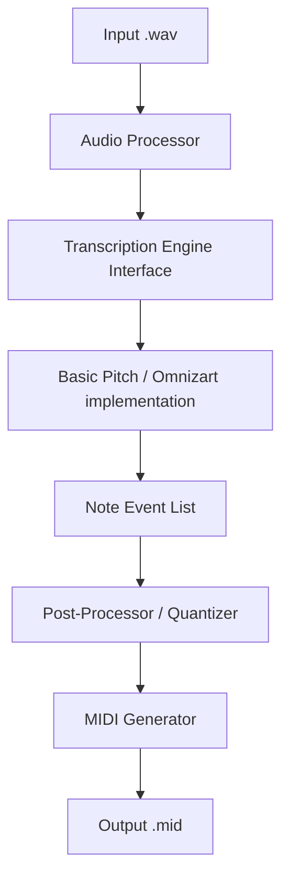

# System Design - Polyphonic Guitar-to-MIDI Converter

## Architecture Overview
The system follows a modular, pipe-and-filter architecture. This design ensures that audio processing, transcription, and MIDI generation are decoupled, allowing for easy updates to the ML models or output formatting logic.

## Component Breakdown

### 1. CLI Controller (`audio2midi.py`)
- **Responsibility:** Entry point for the user. Parses arguments (input path, output path, BPM, quantization grid, thresholds).
- **Workflow Orchestration:** Manages the sequential flow of data between components and provides feedback via a progress bar.

### 2. Audio Processor (`processor.py`)
- **Library:** `librosa` and `scipy.signal`.
- **Functionality:**
    - Loads 16/24-bit .wav files.
    - **Normalization:** Peak normalization to -1.0 dB.
    - **High-Pass Filter:** Butterworth filter (80Hz cutoff) to remove subsonic rumble.
    - **Resampling:** Ensures audio matches the sample rate expected by the ML model (usually 22.05kHz or 44.1kHz).

### 3. Transcription Engine Interface (`engine_base.py`)
- **Abstract Base Class:** Defines the `transcribe(audio_data)` method.
- **Implementation (Primary):** `BasicPitchEngine` utilizing Spotify's `basic-pitch` library. It returns a list of "Note Events" (pitch, start_time, end_time, amplitude).

### 4. Post-Processor & Quantizer (`post_process.py`)
- **Note Cleaning:** Filters notes based on minimum duration (e.g., < 30ms) and velocity thresholds.
- **Quantization Logic:** 
    - Converts seconds to "ticks" based on the provided BPM.
    - Snaps onset and offset ticks to the nearest grid line (e.g., 1/16th note).

### 5. MIDI Generator (`midi_gen.py`)
- **Library:** `pretty_midi` (preferred for its high-level handling of velocity and timing).
- **Output:** Creates a Standard MIDI File (SMF Type 0 or 1) with correct BPM meta-events and track names.

## Technology Stack
- **Language:** Python 3.9+
- **Deep Learning Framework:** TensorFlow (required by `basic-pitch`).
- **Audio Processing:** `librosa`, `pydub` (for bit-depth handling), `numpy`.
- **MIDI Manipulation:** `pretty_midi`.
- **CLI Framework:** `click` or `argparse`.
- **Testing:** `pytest`.

## Performance & Optimization
- **Compute:** Transcription is the primary bottleneck. GPU acceleration will be utilized if `tensorflow-gpu` is available.
- **Memory:** Large files will be processed in chunks if the engine supports it, or the system will warn about high RAM usage for files over 10 minutes.
- **Complexity:** 
    - Audio Pre-processing: O(N) where N is number of samples.
    - Transcription: O(N * model_complexity).
    - Quantization: O(M) where M is number of detected notes.

## Test Strategy
- **Unit Tests:** Validate audio loading, quantization logic, and MIDI generation independently.
- **Integration Tests:** End-to-end transcription of short (5-10s) clips.
- **Accuracy Benchmark:** A script to compare generated MIDI against `GuitarSet` ground truth and calculate F-measure (Precision/Recall).

## Security Considerations
- **File Sanitization:** Ensure input paths are valid and do not allow for path traversal attacks.
- **Library Security:** Use pinned versions of dependencies to avoid supply chain vulnerabilities.
