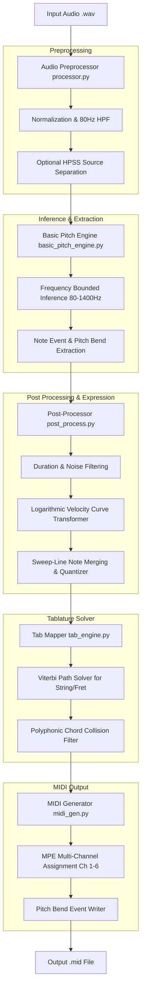

# System Design Specification - Polyphonic Guitar-to-MIDI Enhancements

## 1. Architecture Overview & Data Flow

The system architecture expands the pipe-and-filter pipeline with optional pre-processing filters, model configuration hooks, logarithmic velocity transformers, Viterbi tab solving, and pitch-bend MIDI generation.

```mermaid
graph TD
    A[Input Audio .wav] --> B[Audio Preprocessor processor.py]
    subgraph Preprocessing
        B --> B1[Normalization & 80Hz HPF]
        B1 --> B2[Optional HPSS Source Separation]
    end
    B2 --> C[Basic Pitch Engine basic_pitch_engine.py]
    subgraph Inference & Extraction
        C --> C1[Frequency Bounded Inference 80-1400Hz]
        C1 --> C2[Note Event & Pitch Bend Extraction]
    end
    C2 --> D[Post-Processor post_process.py]
    subgraph Post Processing & Expression
        D --> D1[Duration & Noise Filtering]
        D2[Logarithmic Velocity Curve Transformer]
        D1 --> D2
        D2 --> D3[Sweep-Line Note Merging & Quantizer]
    end
    D3 --> E[Tab Mapper tab_engine.py]
    subgraph Tablature Solver
        E --> E1[Viterbi Path Solver for String/Fret]
        E1 --> E2[Polyphonic Chord Collision Filter]
    end
    E2 --> F[MIDI Generator midi_gen.py]
    subgraph MIDI Output
        F --> F1[MPE Multi-Channel Assignment Ch 1-6]
        F1 --> F2[Pitch Bend Event Writer]
    end
    F2 --> G[Output .mid File]
```

---

## 2. Component Design & Enhancements

### 2.1 Audio Preprocessor ([`src/processor.py`](file:///E:/sw_ws/repo1/audio2midi/src/processor.py))
- **`hpss_filter(audio, sr)`**: Uses `librosa.effects.hpss` to separate harmonic audio from percussive clicks.
- **`apply_spectral_denoise(audio, sr)`**: Smooth noise suppression preserving natural note decay tails.

### 2.2 ML Engine ([`src/basic_pitch_engine.py`](file:///E:/sw_ws/repo1/audio2midi/src/basic_pitch_engine.py))
- Extends `transcribe()` to accept `min_freq=80.0`, `max_freq=1400.0`, `onset_threshold`, `frame_threshold`, `min_note_len`.
- Extracts pitch bend frames returned by `predict()` and converts them into time-stamped MIDI pitch bend tuples `(time_sec, bend_value)` scaled to semi-tone ranges.

### 2.3 Post-Processor ([`src/post_process.py`](file:///E:/sw_ws/repo1/audio2midi/src/post_process.py))
- **`apply_logarithmic_velocity(notes, curvature=5.0)`**: Maps linear model amplitude $a \in [0, 1]$ to MIDI velocity $V \in [1, 127]$:
  $$V = \text{round}\left(127 \times \frac{\ln(1 + k \cdot a)}{\ln(1 + k)}\right)$$
- **`quantize_notes(notes, bpm, grid_resolution, strength=1.0)`**: Applies partial quantization strength interpolation:
  $$t_{\text{final}} = t_{\text{original}} + \text{strength} \times (t_{\text{quantized}} - t_{\text{original}})$$

### 2.4 Tablature Engine ([`src/tab_engine.py`](file:///E:/sw_ws/repo1/audio2midi/src/tab_engine.py))
- **`ViterbiTabSolver`**:
  - State space $S$: Valid `(string, fret)` pairs for pitch $P$.
  - Transition Cost $C(s_i, s_{i+1})$: $w_{\text{fret}} \cdot |f_{i+1} - f_i| + w_{\text{string}} \cdot |s_{i+1} - s_i| + w_{\text{open}} \cdot \mathbb{I}(f=0)$.
  - Time complexity: $O(N \cdot K^2)$ where $N$ is note count and $K \le 5$ string placement candidates per pitch.
- **Chord Collision Guard**: Enforces that for notes with $|t_{\text{onset}, A} - t_{\text{onset}, B}| < 15\text{ms}$, $s_A \neq s_B$.

### 2.5 MIDI Generator ([`src/midi_gen.py`](file:///E:/sw_ws/repo1/audio2midi/src/midi_gen.py))
- Configures 6 MIDI channels (Channels 1–6 for Strings 1–6) when MPE/tab mode is enabled.
- Writes note events and pitch bend events per channel using `pretty_midi`.

---

## 3. Technology Stack & Infrastructure

- **Language:** Python 3.10.x
- **Pre-processing:** `librosa` (0.10+), `scipy.signal`, `numpy` (<2.0.0)
- **ML Engine:** `basic-pitch` (Spotify), `tensorflow` (2.7+)
- **MIDI Output:** `pretty_midi`, `mido`
- **CLI Framework:** `click`
- **Testing & Benchmarking:** `pytest`, `pytest-mock`

---

## 4. Performance & Complexity Analysis

| Operation | Complexity | Expected Bottleneck | Optimization Strategy |
| :--- | :--- | :--- | :--- |
| **Audio HPSS** | $O(N \log N)$ FFT | Moderate CPU compute | Optional flag `--hpss`; process in STFT frame blocks |
| **Basic Pitch Inference** | $O(N)$ DNN Forward Pass | Primary Compute Bottleneck | Restrict frequency bounds; batch model execution |
| **Viterbi String Solver** | $O(N \cdot K^2)$ ($K \le 5$) | Very Low (< 10ms for 1000 notes) | Pre-computed pitch-to-(string,fret) LUT |
| **Log Velocity Mapping** | $O(N)$ | Negligible | Vectorized NumPy array operations |
| **MIDI Generation** | $O(N)$ | Negligible | Stream writing via `pretty_midi` |

---

## 5. Test Strategy & Isolation

- **Unit Testing (Isolated):**
  - [`processor.py`](file:///E:/sw_ws/repo1/audio2midi/src/processor.py): HPSS filter response, high-pass frequency cutoff validation.
  - [`post_process.py`](file:///E:/sw_ws/repo1/audio2midi/src/post_process.py): Velocity curve mathematical mapping, partial quantization interpolation.
  - [`tab_engine.py`](file:///E:/sw_ws/repo1/audio2midi/src/tab_engine.py): Viterbi path cost optimization, chord string collision guard.
- **Integration Testing (Component Mocking):**
  - Mock `basic-pitch` output using synthesized synthetic note tuples to verify post-processing and MIDI generation end-to-end without running ML inference during fast unit test runs.
- **End-to-End & Benchmark Testing:**
  - Full transcription pipeline run against `GuitarSet` clips, evaluating F-measure against ground truth.
