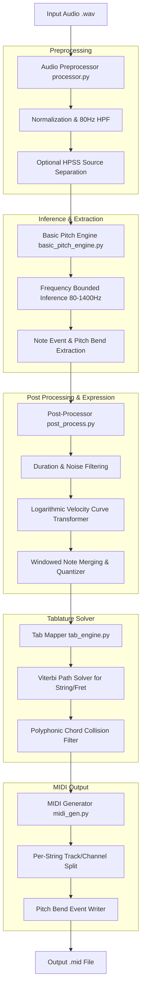

# System Design Specification - Polyphonic Guitar-to-MIDI Enhancements

## 1. Architecture Overview & Data Flow

The system architecture expands the pipe-and-filter pipeline with optional pre-processing filters, model configuration hooks, logarithmic velocity transformers, Viterbi tab solving, and pitch-bend MIDI generation.

```mermaid
graph TD
    A[Input Audio .wav] --> B[Audio Preprocessor processor.py]
    subgraph Preprocessing
        B --> B1[Normalization & 80Hz HPF]
        B1 --> B2[Optional HPSS Source Separation]
    end
    B2 --> C[Basic Pitch Engine basic_pitch_engine.py]
    subgraph Inference & Extraction
        C --> C1[Frequency Bounded Inference 80-1400Hz]
        C1 --> C2[Note Event & Pitch Bend Extraction]
    end
    C2 --> D[Post-Processor post_process.py]
    subgraph Post Processing & Expression
        D --> D1[Duration & Noise Filtering]
        D2[Logarithmic Velocity Curve Transformer]
        D1 --> D2
        D2 --> D3[Windowed Note Merging & Quantizer]
    end
    D3 --> E[Tab Mapper tab_engine.py]
    subgraph Tablature Solver
        E --> E1[Viterbi Path Solver for String/Fret]
        E1 --> E2[Polyphonic Chord Collision Filter]
    end
    E2 --> F[MIDI Generator midi_gen.py]
    subgraph MIDI Output
        F --> F1[Per-String Track/Channel Split]
        F1 --> F2[Pitch Bend Event Writer]
    end
    F2 --> G[Output .mid File]
```

---

## 2. Component Design & Enhancements

### 2.1 Audio Preprocessor ([`src/processor.py`](file:///E:/sw_ws/repo1/audio2midi/src/processor.py))
- **`hpss_filter(audio, margin=1.0)`**: Uses `librosa.effects.hpss` to separate harmonic audio from percussive clicks.
- **`high_pass_filter(audio, sr, cutoff=80)`**: One-pole RC high-pass, `y[n] = α·(y[n-1] + x[n] - x[n-1])`, evaluated via `scipy.signal.lfilter` with `b = [α, -α]`, `a = [1, -α]` and `y[0] == x[0]`. Not a Butterworth, despite earlier revisions of this document.
- **`noise_gate(audio, threshold, frame_length, hop_length, smoothing_frames)`**: Thresholds a smoothed short-term RMS envelope and applies the result as a gain curve, so note decay tails are attenuated smoothly rather than clipped sample-by-sample. This supersedes the `apply_spectral_denoise(audio, sr)` entry point named in earlier revisions, which was never implemented; it satisfies the FR-02 intent of protecting decay tails from a hard gate.

### 2.2 ML Engine ([`src/basic_pitch_engine.py`](file:///E:/sw_ws/repo1/audio2midi/src/basic_pitch_engine.py))
- Extends `transcribe()` to accept `min_freq=80.0`, `max_freq=1400.0`, `onset_threshold`, `frame_threshold`, `min_note_len`, `include_pitch_bends`.
- Reads each note's **own** bend contour from the fifth element of its `predict()` note event (units of 1/3 semitone). Values scale by $4096/3$ into MIDI ticks, clamped to the 14-bit signed range $[-8192, 8191]$; times are `linspace(start, end, len(contour))`. Emitted as dicts `{'pitch': int, 'time': float}`.
- Bends are **not** matched to notes by time window: a bend is owned by exactly one note by construction, so a single string's bend is never copied onto simultaneously sounding notes.
- Velocity is clamped to $[1, 127]$; a velocity of 0 is a note-off in most DAWs.

### 2.3 Post-Processor ([`src/post_process.py`](file:///E:/sw_ws/repo1/audio2midi/src/post_process.py))
- **`apply_logarithmic_velocity(notes, curvature=5.0)`**: Maps linear model amplitude $a \in [0, 1]$ to MIDI velocity $V \in [1, 127]$:
  $$V = \text{round}\left(127 \times \frac{\ln(1 + k \cdot a)}{\ln(1 + k)}\right)$$
- **`quantize_notes(notes, bpm, grid_resolution, strength=1.0)`**: Applies partial quantization strength interpolation, writing `start_ticks`/`end_ticks` at 480 ticks per quarter:
  $$t_{\text{final}} = t_{\text{original}} + \text{strength} \times (t_{\text{quantized}} - t_{\text{original}})$$
- **`ticks_to_seconds(notes, bpm)`**: Applies those tick values back to `start`/`end`, and maps each note's bend times onto the new span. Without this, bends keep their pre-quantization absolute times and fall outside the note that owns them.
- **`merge_notes(notes)`**: Groups by pitch and merges consecutive same-pitch notes that overlap (or fall within 50 ms) **while another pitch is sounding through them** — the marker distinguishing engine chatter from a genuine re-pluck. The concurrency test binary-searches the start-sorted list over a bounded time window, so cost scales with window density rather than $N$. Earlier revisions described this as a sweep-line; it is not, and the vestigial unused event list has been removed. Merges carry the absorbed note's bend contour.

### 2.4 Tablature Engine ([`src/tab_engine.py`](file:///E:/sw_ws/repo1/audio2midi/src/tab_engine.py))
- **`TabMapper`** (named `ViterbiTabSolver` in earlier revisions of this document):
  - State space $S$: valid collision-free `(string, fret)` **frame assignments** — the Cartesian product of per-note placements across one chord frame, not a single note's placements.
  - Emission Cost $E(s)$, applied at **every** frame: $|\overline{f_{\text{fretted}}} - 5| - w_{\text{open}} \cdot \frac{|\{f = 0\}|}{|s|}$. Open strings are excluded from the position average because they do not constrain the fretting hand, and the open-string bonus is averaged over the frame so it does not grow with polyphony. Applying this only at frame 0 (as earlier revisions did) leaves absolute neck position unanchored for the rest of the piece.
  - Transition Cost $C(s_i, s_{i+1})$: $w_{\text{fret}} \cdot |\overline{f_{i+1}} - \overline{f_i}| + w_{\text{string}} \cdot |\overline{s_{i+1}} - \overline{s_i}|$, with $w_{\text{fret}} = 1.5$, $w_{\text{string}} = 0.5$. The open-string term lives in the emission cost only; counting it here as well double-counts it once per transition.
  - Time complexity: $O(T \cdot K^2)$ over $T$ chord frames, where $K$ is the candidate count per frame. $K$ is the size of an unbounded Cartesian product, so it is capped (`max_candidates`, default 64) by keeping the lowest-emission-cost candidates. Measured $K$ for real chords is 1–34.
- **Chord Collision Guard**: Enforces that for notes with $|t_{\text{onset}, A} - t_{\text{onset}, B}| < 15\text{ms}$, $s_A \neq s_B$. Pitches with no valid placement fall back to $(0, -1)$ and route to the default track.
- **Collision Fallback** (`_best_effort_assignment`): when the frame admits no collision-free combination — more than six simultaneous notes, or duplicate detections of a single-placement pitch — an exact bipartite matching (augmenting paths, most-constrained note first) maximizes the count of notes on distinct strings, and any remainder takes its placement closest to $\text{PREFERRED\_FRET}$. Earlier revisions took each note's first placement, which could pile four notes onto string 6 while strings 1–5 sat free. See the FR-06 note in [`requirements.md`](./requirements.md) for why a residual collision is unavoidable rather than a solver defect.

### 2.5 MIDI Generator ([`src/midi_gen.py`](file:///E:/sw_ws/repo1/audio2midi/src/midi_gen.py))
- Creates one `pretty_midi.Instrument` per string (Strings 1–6) when tab mode is enabled; each becomes its own track and channel on write. Because a physical string sounds one note at a time, each voice gets an independent bend stream. `pretty_midi` allocates the literal channel numbers itself, so the design controls the track split rather than fixed channel indices.
- Writes note events and each note's pitch bend events per track, clamped to $[-8192, 8191]$, with consecutive redundant values dropped and a recentre to 0 at each note's end so bends do not bleed into the next note on that channel.

---

## 3. Technology Stack & Infrastructure

- **Language:** Python 3.10.x
- **Pre-processing:** `librosa` (0.10+), `scipy.signal`, `numpy` (<2.0.0)
- **ML Engine:** `basic-pitch` (Spotify), `tensorflow` (2.7+)
- **MIDI Output:** `pretty_midi`, `mido`
- **CLI Framework:** `click` (numeric options constrained with `IntRange`/`FloatRange`)
- **Testing & Benchmarking:** `pytest`, `pytest-mock`
- **Lint & CI:** `ruff` (`ruff.toml`), GitHub Actions (`.github/workflows/ci.yml`) running lint plus the `not slow` suite with a branch-coverage gate (`.coveragerc`, `fail_under = 95`)
- **Packaging:** `setup.py` with flat `py_modules` under `src/`. `find_packages(where="src")` returns nothing here because `src/` holds modules rather than a package, and would install no code at all.

---

## 4. Performance & Complexity Analysis

| Operation | Complexity | Expected Bottleneck | Optimization Strategy |
| :--- | :--- | :--- | :--- |
| **High-Pass Filter** | $O(N)$ | Negligible when vectorized | `scipy.signal.lfilter`; a per-sample Python loop measured ~170x slower (1.25 s vs 0.007 s for 30 s @ 22.05 kHz) |
| **Audio HPSS** | $O(N \log N)$ FFT | Moderate CPU compute | Optional flag `--hpss`; process in STFT frame blocks |
| **Noise Gate** | $O(N)$ | Negligible | RMS envelope + gain interpolation, both vectorized |
| **Basic Pitch Inference** | $O(N)$ DNN Forward Pass | Primary Compute Bottleneck | Restrict frequency bounds; batch model execution |
| **Note Merging** | $O(N \log N + N \cdot W)$, $W$ = notes per time window | Low (~0.37 s for 20 000 notes) | Binary-search the start-sorted list instead of a full scan per candidate |
| **Viterbi String Solver** | $O(T \cdot K^2)$ over $T$ frames | Low; $K$ is an unbounded Cartesian product | Pre-computed pitch-to-(string,fret) LUT; cap candidates per frame at `max_candidates` (64) |
| **Log Velocity Mapping** | $O(N)$ | Negligible | Vectorized NumPy array operations |
| **MIDI Generation** | $O(N)$ | Negligible | Stream writing via `pretty_midi` |

---

## 5. Test Strategy & Isolation

- **Unit Testing (Isolated):**
  - [`processor.py`](file:///E:/sw_ws/repo1/audio2midi/src/processor.py): HPSS filter response, high-pass frequency cutoff validation.
  - [`post_process.py`](file:///E:/sw_ws/repo1/audio2midi/src/post_process.py): Velocity curve mathematical mapping, partial quantization interpolation.
  - [`tab_engine.py`](file:///E:/sw_ws/repo1/audio2midi/src/tab_engine.py): Viterbi path cost optimization, chord string collision guard.
- **Integration Testing (Component Mocking):**
  - Mock `basic-pitch` output using synthesized synthetic note tuples to verify post-processing and MIDI generation end-to-end without running ML inference during fast unit test runs.
- **End-to-End & Benchmark Testing:**
  - Full transcription pipeline run against the reference recordings in `tests/`, asserting note-count bands and output tempo. These are marked `slow` and deselected with `-m "not slow"`.
  - **Not yet implemented:** the `GuitarSet` F-measure benchmark against ground-truth annotations described in `requirements.md` (NFR accuracy target). No corpus, scoring script, or ground-truth comparison exists in this repository; the note-count bands are a regression tripwire, not an accuracy measurement.
