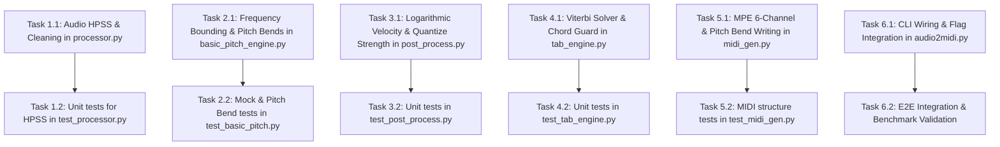

# Implementation Plan Specification - Polyphonic Guitar-to-MIDI Enhancements

## 1. Task Breakdown & Dependency Graph

---

## 2. Implementation Tasks

### Phase 1: Audio Preprocessing Enhancements
- **Task 1.1: Implement HPSS and Spectral Denoising in [`processor.py`](file:///E:/sw_ws/repo1/audio2midi/src/processor.py)**
  - **Estimate:** 1.5h
  - **Satisfies Requirements:** FR-02, AC-02
  - **Verification Method:** TR-03 (`tests/test_processor.py`)
  - **Test Strategy:** TDD (write test in `test_processor.py` first)
  - **Completion Criteria:** `hpss_filter` separates percussive click transients from harmonic audio without phase distortion.

### Phase 2: Engine Inference & Expressive Pitch Bends
- **Task 2.1: Implement Frequency Bounding and Pitch Bend Extraction in [`basic_pitch_engine.py`](file:///E:/sw_ws/repo1/audio2midi/src/basic_pitch_engine.py)**
  - **Estimate:** 2h
  - **Satisfies Requirements:** FR-01, FR-04, AC-01, AC-04
  - **Verification Method:** TR-01, TR-05 (`tests/test_audio2midi.py`, `tests/test_midi_gen.py`)
  - **Test Strategy:** TDD / Mocking
  - **Completion Criteria:** Notes outside 80 Hz – 1,400 Hz are ignored; frame-level pitch bend lists are returned alongside note events.

### Phase 3: Post-Processing & Dynamic Velocity Response
- **Task 3.1: Implement Logarithmic Velocity Transformation and Partial Quantization in [`post_process.py`](file:///E:/sw_ws/repo1/audio2midi/src/post_process.py)**
  - **Estimate:** 1.5h
  - **Satisfies Requirements:** FR-03, AC-03
  - **Verification Method:** TR-04 (`tests/test_post_process.py`)
  - **Test Strategy:** TDD
  - **Completion Criteria:** `apply_logarithmic_velocity` transforms amplitude $a \in [0, 1]$ to logarithmically scaled MIDI velocities $V \in [1, 127]$.

### Phase 4: Ergonomic Tablature Solver
- **Task 4.1: Implement Viterbi Tab Solver & Polyphonic Chord Collision Guard in [`tab_engine.py`](file:///E:/sw_ws/repo1/audio2midi/src/tab_engine.py)**
  - **Estimate:** 2.5h
  - **Performance Sensitive:** Yes ($O(N \cdot K^2)$ execution benchmarked $\le 10\text{ms}$ for 1,000 notes)
  - **Satisfies Requirements:** FR-06, AC-06
  - **Verification Method:** TR-07, TR-08 (`tests/test_tab_engine.py`)
  - **Test Strategy:** TDD
  - **Completion Criteria:** Sequence of notes calculates optimal path minimizing fret jumps; chord notes on identical timestamps are assigned to separate physical strings.

### Phase 5: MPE MIDI Generation
- **Task 5.1: Implement MPE 6-Channel Output & Pitch Bend MIDI Writing in [`midi_gen.py`](file:///E:/sw_ws/repo1/audio2midi/src/midi_gen.py)**
  - **Estimate:** 1.5h
  - **Satisfies Requirements:** FR-04, FR-05, AC-04, AC-05
  - **Verification Method:** TR-05, TR-06 (`tests/test_midi_gen.py`)
  - **Test Strategy:** TDD
  - **Completion Criteria:** Strings 1–6 output to MIDI Channels 1–6 with corresponding `pretty_midi.PitchBend` events.

### Phase 6: Integration, CLI & Documentation
- **Task 6.1: Wire New Parameters into CLI Entry Point [`audio2midi.py`](file:///E:/sw_ws/repo1/audio2midi/src/audio2midi.py)**
  - **Estimate:** 1h
  - **Satisfies Requirements:** All FRs, AC-01 through AC-06
  - **Verification Method:** TR-02, TR-09 (`tests/test_cli.py`, `tests/test_regression.py`)
  - **Completion Criteria:** `audio2midi.py --help` documents all new flags (`--hpss`, `--onset-threshold`, `--velocity-curve`, `--pitch-bend`); E2E test runs cleanly.
- **Task 6.2: Update Documentation and Project Overview Docs**
  - **Estimate:** 1h
  - **Satisfies Requirements:** Section 4 Documentation Standards
  - **Completion Criteria:** `README.md` and `docs/PROJECT_OVERVIEW.md` updated with full usage instructions, architecture diagrams, and learnings.
